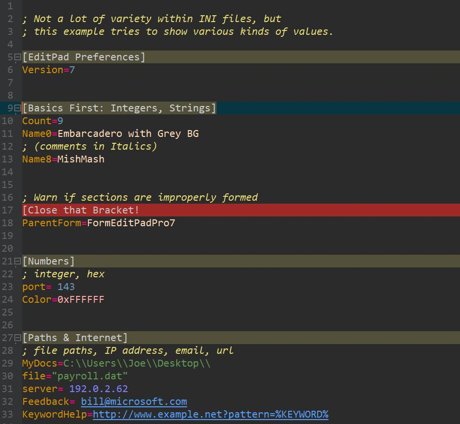

INI Coloring Scheme for MishMash in EditPad Pro
==

1. If you don't have EditPad **[click here for a free trial](http://yu8.us/eppdemo)**

2. This scheme is specifically intented for the MishMash color palette.
You can [download MishMash here](https://github.com/boolbag/EditPad-Goodies/tree/master/Making%20Text%20Pretty%20-%20Syntax%20Coloring%20and%20Color%20Palettes/Color%20Palettes/MishMash).

## First, a Screenshot

## How to Install?

1. Don't have EditPad Pro? Get the **[click here for a free trial](http://yu8.us/eppdemo)**

2. Installing the actual syntax-coloring scheme
 
   * Semi-Automatic Method. Like for all other syntax-coloring schemes, within EditPad, go to _Options / Configure File Types / Colors and Syntax Tab / Syntax Coloring Scheme pull-down menu_ and hit _Download_.

   * Manual Method: drop the `.jgcscs` file at the top of this page into the `%APPDATA%\JGsoft\EditPad Pro 7` folder (to navigate to that folder, copy that path and paste it in the address bar of your file manager, e.g. Windows Explorer)

## A Few Words About the Scheme

* I looked at the Just Great Software _INI_ scheme as a point of departure, but wanted to expand the syntax to make the files more lively
* Separated the 'equal sign' (`=`) from the token to its left so that each have their own color
* Colored the values
* To make the scheme more interesting, tried to distinguish between various types of values: 
     - integers
     - hex numbers
     - some Boolean pairs: true/false, yes/no, show/hide
     - email addresses
     - urls
     - file paths
     - IP addresses
     - other kinds of strings (catch-all)

## Improvements

I didn't put a whole lot of thought into this, so if you have suggestions, please don't hesitate to get in touch.