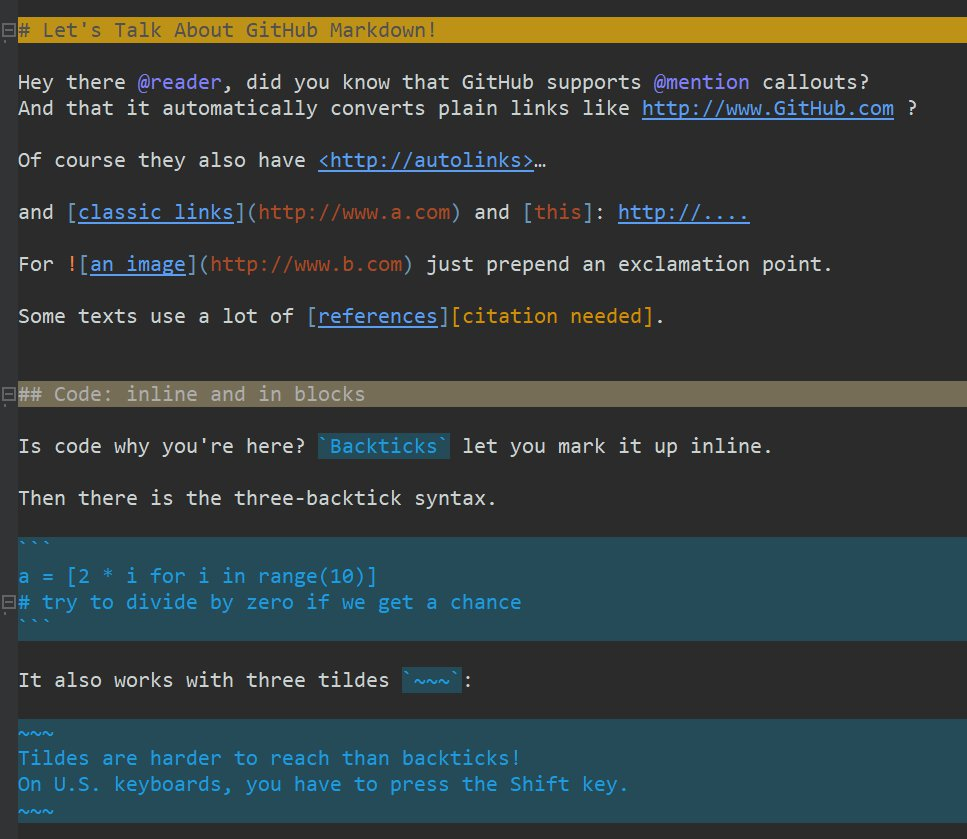
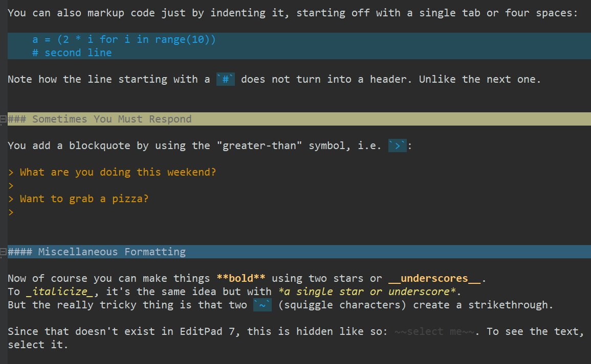
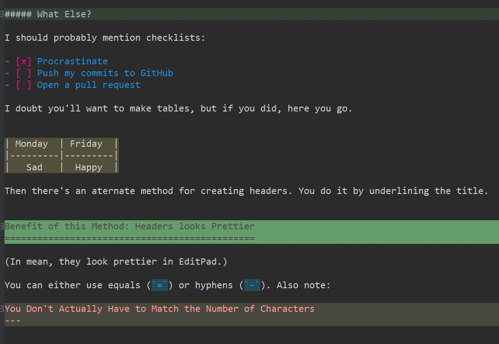
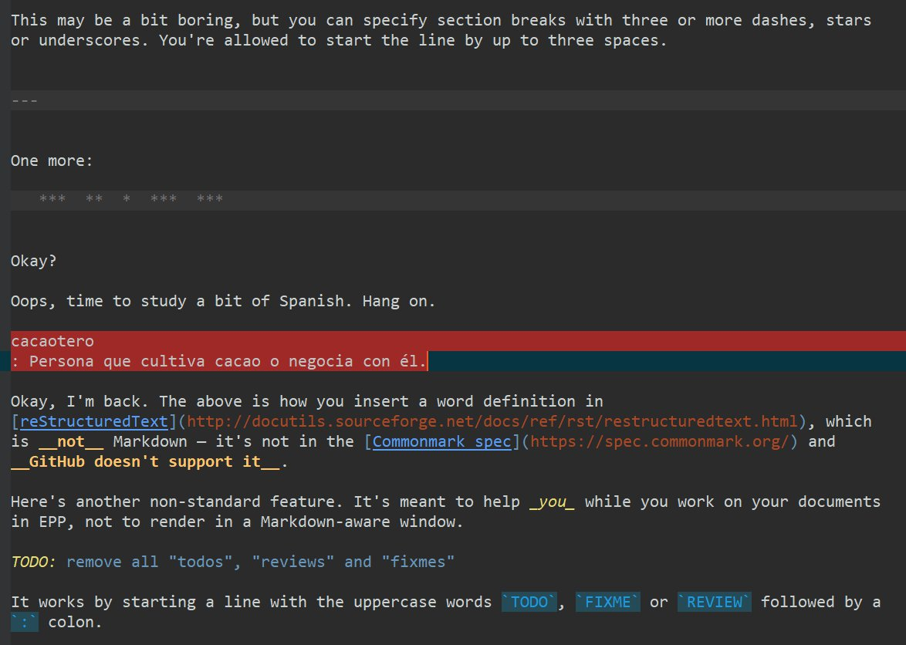
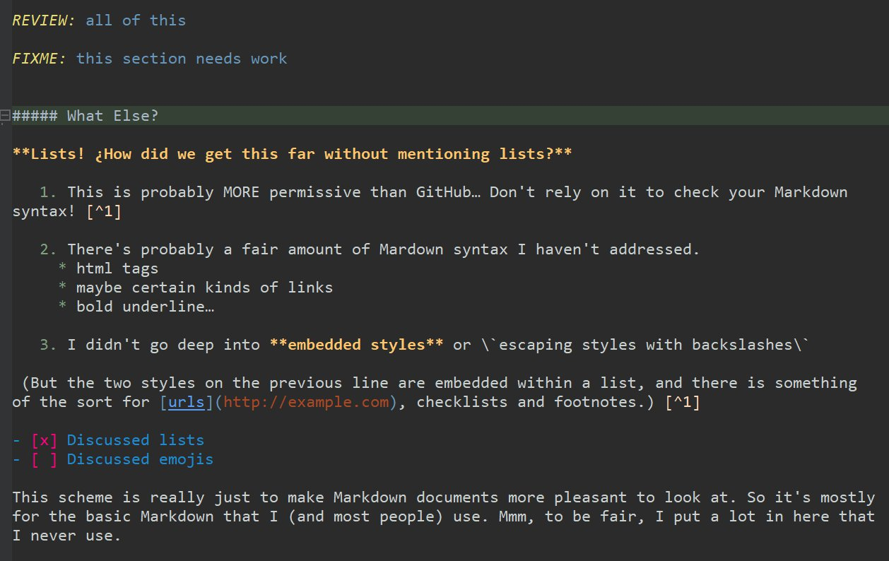
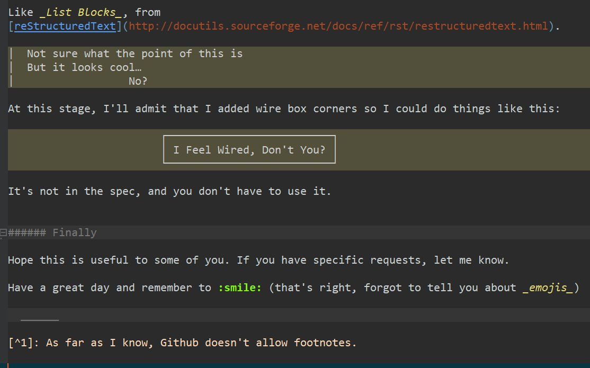

# TL;DR This scheme was made specifically for the MishMash color palette

1. If you don't have EditPad **[click here for a free trial](http://yu8.us/eppdemo)**

2. If you want this scheme to look good, first install the [MishMash color palette](/Making%20Text%20Pretty%20-%20Syntax%20Coloring%20and%20Color%20Palettes/Color%20Palettes/MishMash) into EditPad.

## Here are six screenshots that also explain the scheme and the basics of Markdown

Just so you know, I may have changed the scheme slightly since making the screenshots.

### Screenshot 1

### Screenshot 2

### Screenshot 3

### Screenshot 4

### Screenshot 5

### Screenshot 6

## How to Install?

1. Don't have EditPad Pro? Get the **[click here for a free trial](http://yu8.us/eppdemo)**

2. Like all other syntax-coloring schemes: directly in EditPad. Go to _Options / Configure File Types / Colors and Syntax Tab / Syntax Coloring Scheme pull-down menu_ and hit _Download_.

Resources
---------
* [Github-Flavored Markdown](https://github.github.com/gfm)
* [Markdown Cheat Sheet](https://www.markdownguide.org/cheat-sheet/)
* [Commonmark Spec](https://spec.commonmark.org/)
* [Multimarkdown](https://rawgit.com/fletcher/MultiMarkdown-6-Syntax-Guide/master/index.html)
* [Spec Markdown](https://leebyron.com/spec-md/) (a flavor of Markdown for writing **specs**, technical documents etc.)
* [Critic Markdown](http://criticmarkup.com/users-guide.php) (another flavor with non-standard features)
* [reStructuredText](http://docutils.sourceforge.net/docs/ref/rst/restructuredtext.html)
