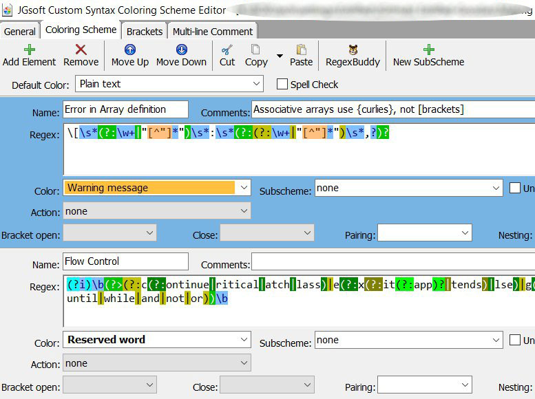

If you don't have EditPad **[click here for a free trial](http://yu8.us/eppdemo)**

## TL;DR: Give Me Some Syntax-Coloring Schemes

- [Anki](https://github.com/boolbag/EditPad-Goodies/tree/master/Making%20Text%20Pretty%20-%20Syntax%20Coloring%20and%20Color%20Palettes/Syntax%20Coloring%20Schemes/4Anki)
- [Autohotkey](https://github.com/boolbag/EditPad-Goodies/tree/master/Making%20Text%20Pretty%20-%20Syntax%20Coloring%20and%20Color%20Palettes/Syntax%20Coloring%20Schemes/AuthoHotkey)
- [INI](https://github.com/boolbag/EditPad-Goodies/tree/master/Making%20Text%20Pretty%20-%20Syntax%20Coloring%20and%20Color%20Palettes/Syntax%20Coloring%20Schemes/INI/)
- [Markdown](https://github.com/boolbag/EditPad-Goodies/tree/master/Making%20Text%20Pretty%20-%20Syntax%20Coloring%20and%20Color%20Palettes/Syntax%20Coloring%20Schemes/Markdown)

In EditPad, what is a Syntax-Coloring Scheme?
===

TL;DR: it is a file which you absolutely have to import if you want EPP to display the syntax of your file gracefully.

---

A Syntax-Coloring Scheme is a configuration file that lives in the EditPad configuration folder, i.e. `%APPDATA%\JGsoft\EditPad Pro 7` (you can paste that string in your file manager and it will take you there.)

That file tells EditPad how to parse a language (for instance, telling it that `if` and `for` are special words pertaining to the category of `flow control`), and which `color classes` to apply. 

Please read that again: which `color classes`… but __not__ which _specific colors_.

What is a `color class`? It is a special label, such as "Function name" or "Internet Link" which corresponds to specific colors defined in each color palette. 

In other words, the syntax-coloring scheme might say that sequences `/* like this one*/` belong to the class called _Documentation comment_. Then, depending on which [color palette](/Making%20Text%20Pretty%20-%20Syntax%20Coloring%20and%20Color%20Palettes/Color%20Palettes) you are using, EPP will display such sequence using whichever colors are set for the  _Documentation comment_ class.

## How are Syntax-Coloring Schemes imported?   

Easy. _Options / Configure File Types / Colors and Syntax Tab / Syntax Coloring Scheme pull-down menu_.

## Can I Adapt an Existing Coloring Scheme to a Different Color Palette?

**YES!** You must!

The fact is that most coloring schemes only work well in the palette they were designed for. If you want it to work well with a different palette, the best is to copy the scheme and change the color assignments inside of it — which is as easy as picking from a pull-down menu.

**I have explained this process in detail on [the MishMash page](/Making%20Text%20Pretty%20-%20Syntax%20Coloring%20and%20Color%20Palettes/Color%20Palettes/MishMash)** — look for the _Adapting Existing Schemes for MishMash_ section.

## How are Syntax-Coloring Schemes created?

They are created using JGSoft's dedicated tool called the [JGsoft Custom Syntax Coloring Scheme Editor](https://www.editpadpro.com/cscs.html), which is a free download for EditPad Pro users. 

The tool is easy to use if you know regular expressions. Basically, you create a regular expression to match each piece of syntax, such as comments, functions and so on.
 
If you don't know regex… Forget it. (Or learn regular expressions on Jan's site or mine, [RexEgg](http://www.RexEgg.com).

