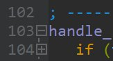
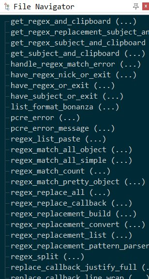

### Let's Collaborate on Navigation Schemes!

At the moment there's nothing in this folder.

What is a File Navigation Scheme?
==

In EditPad Pro, a _File Navigation Scheme_ is a file that tells EditPad how to "chop up" the file in meaningful chunks. This is visible to the user in two places:

1. Code folding (the ⊕ and ⊖ symbols in the left gutter that allow you to expand or fold sections of the file)

2. The **File Navigator** (under _View / File Navigator_ that lets you jump to a specific section or function in your code

### How to Download Navigation Schemes?

* In general, you _download_ file navigation schemes from within EditPad. Go to _Options / Configure File Types / Navigation Tab_ and click the _Download_ button if the scheme you want isn't already in the pull-down menu.

* …or, to download manually, visit the [Navigation Scheme](https://www.editpadpro.com/fns.html) page. 

### How to Edit or even Create Navigation Schemes?

To edit or create schemes, visit the [Navigation Scheme](https://www.editpadpro.com/fns.html) page and download the _JGsoft File Navigation Scheme Editor_, which is free for EditPad Pro users. 

The tool is easy to use if you know regular expressions. Basically, you create a regular expression to match each piece of syntax, such as comments, functions and so on.

If you don't know regex… Forget it. (Or learn regular expressions on Jan's site or mine, [RexEgg](http://www.RexEgg.com)).
