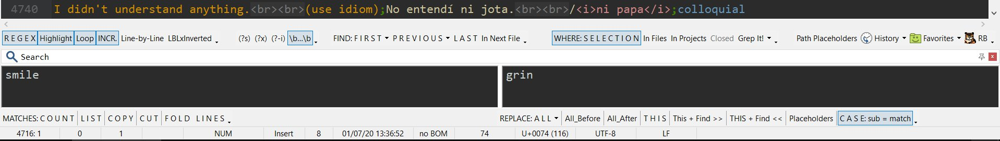

# 2020 Version
In January 2020, shortly after EditPad Pro 8 came out, I made drastic edits to my Search toolbar. One inspiration came from a screenshot on the EPP forum, where a user had buttons both above and below the search boxes. I also liked how he used spaced uppercase on some buttons.

This made me redesign my Search toolbar, which is now in fact composed of seven separate toolbars: five at the top, two at the bottom. 

The benefit of having five toolbars on a single row (at the top), and two at the bottom is that it's easier to control the spacing and make things breathe. With the seven toolbars, I can keep buttons within certain themes:

- Search Mode (regex, incremental, …)
- Search Modifiers (free-spacing, words, …)
- Find specs (first, previous, …)
- Where to search (this file, this project, grep, …)
- Misc (Placeholders, Favorites, …) 
- What to do with the match: count, list, copy, …
- Replace specs (replace all, replace this and skip, …)

Won't rewrite the whole logic of certain choices as a lot of that was explained with the 2019 version below.

# 2019 Version: Simplified Look for Hard Work

The point of the screenshot is not the syntax coloring, but the **search bar** itself.

The title says it all: the goal was to get rid of confusing icons and place functions on the bar in ways I can understand. 

### Tokens not Words

For instance, the `(?s)` button makes it clear what is being turned on.

### Words not Icons
 - Some of the icons were really confusing to me. It's easier for me to read `subALL` than to understand which of the icons replaces all the matches in a file. 
 - Likewise for things like Favorites, History, RB…

### Removing dangerous buttons from the bar

It could be a good idea to remove the `Files` and `Projects` buttons from the bar. They can always be found under the `Search` menu. The risk is to hit `sub ALL` (`Replace All`) and replace everything in all projects.

### Not a Perfect Scheme!

Always looking for improvements. Just sharing it to stimulate discussion. Looking forward to any thoughts.
   