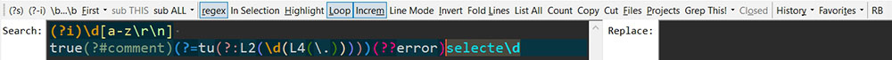

# Simplified Look for Hard Work

The point of the screenshot is not the syntax coloring, but the **search bar** itself.

The title says it all: the goal was to get rid of confusing icons and place functions on the bar in ways I can understand. 

### Tokens not Words

For instance, the `(?s)` button makes it clear what is being turned on.

### Words not Icons
 - Some of the icons were really confusing to me. It's easier for me to read `subALL` than to understand which of the icons replaces all the matches in a file. 
 - Likewise for things like Favorites, History, RB…

### Removing dangerous buttons from the bar

It could be a good idea to remove the `Files` and `Projects` buttons from the bar. They can always be found under the `Search` menu. The risk is to hit `sub ALL` (`Replace All`) and replace everything in all projects.

### Not a Perfect Scheme!

Always looking for improvements. Just sharing it to stimulate discussion. Looking forward to any thoughts.
   